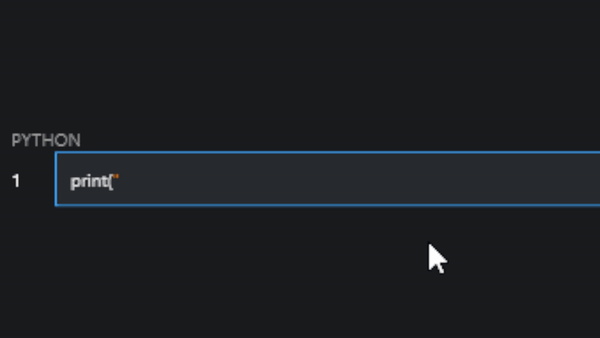

# ⌨️ | Flet CodeField Control

## 📚 | Overview
A custom `TextField` control ripoff with syntax highlighting. Uses the `Markdown` control under the hood.

## ⚠️ | Limitations
- Only works for Windows (tested), Linux (untested), MacOS (untested). Mobile devices will not work with this.
- Pressing Tab will automatically focus a focus-able control. I can't prevent this due to Flet limitations.
- The default shift key mapping is for the UK layout. You can provide a custom mapping by passing it to one of the parameters.
- You cannot select the code.
- There is no text cursor, making it difficult to find out where you're typing.

## 🤔 | Example
If you want an example, follow the setup instructions below and run `src/CodeField.py`.

## 💻 | Setup
- Run `git clone https://github.com/Cuh4/FletCodeField && cd FletCodeField`
- Run `pip install -r requirements.txt`
- Extract `src/CodeField.py` to your project directory.
- Import it in your code (`from CodeField import CodeField`) and use it as a Flet Control.

## ✨ | Credit
- **Cuh4** ([GitHub](https://github.com/Cuh4))